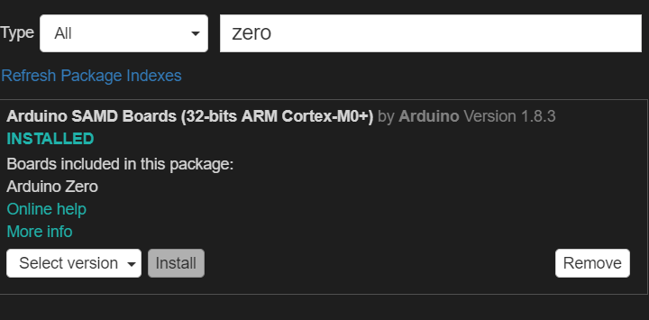
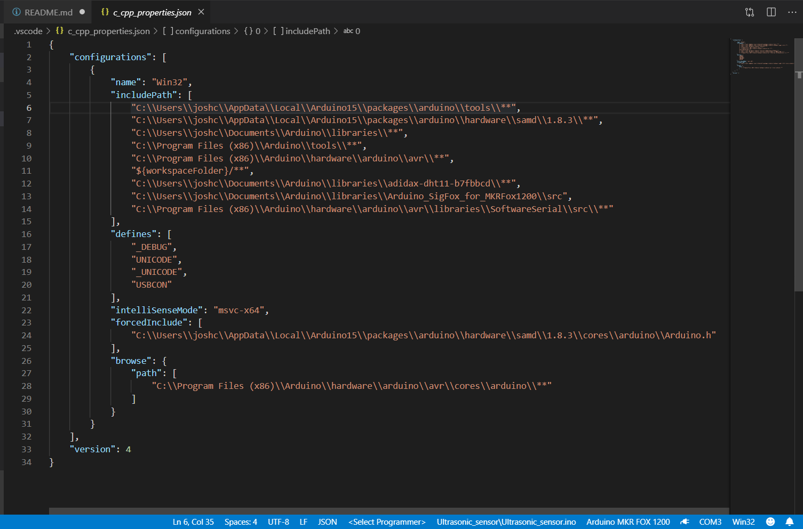

# SigfoxResources
## MKRFOX 1200
Arduino MKRFOX1200 has been designed to offer a practical and cost effective solution for makers seeking to add SigFox connectivity to their projects with minimal previous experience in networking.

It is based on the Microchip [SAMD21](http://www.atmel.com/Images/Atmel-42181-SAM-D21_Summary.pdf) and a [ATA8520](http://www.atmel.com/Images/Atmel-9372-Smart-RF-ATA8520_Datasheet.pdf) SigFox module.

### Long Battery Life
Can run for over six months on two AA 1.5V batteries with typical usage. .
The design includes the ability to power the board using two 1.5V AA or AAA batteries or external 5V. Switching from one source to the other is done automatically.


A good 32-bit computational power similar to the Zero board, the usual rich set of I/O interfaces, low power SigFox communication and the ease of use of the Arduino Software (IDE) for code development and programming. All these features make this board the preferred choice for the emerging IoT battery-powered projects in a compact form factor.

The USB port can be used to supply power (5V) to the board.
The Arduino MKRFOX1200 is able to run with or without the batteries connected and has limited power consumption.
Warning: Unlike most Arduino & Genuino boards, the MKRFOX1200 runs at 3.3V. The maximum voltage that the I/O pins can tolerate is 3.3V. Applying voltages higher than 3.3V to any I/O pin could damage the board. While output to 5V digital devices is possible, bidirectional communication with 5V devices needs proper level shifting.

You can find [here](https://www.arduino.cc/en/Main/warranty) your board warranty informations.

If you want more informations on SIGFOX please visit makers.sigfox.com and ask.sigfox.com

## Setting Up Using Visual Studio Code
-  Download and install [Visual Studio Code](https://code.visualstudio.com/Download)
- Download and Install [Arduino](https://www.arduino.cc/en/Main/Software)
- Add the Atmel SAMD Core to Arduino via the Boards Manager and Search Zero to find and install the core



To search and install the board on Visual studio code Open the Command Pallete via **CTRL + Shift + P** then type the Command
```
Arduino:Board Manager
```

- Download the Arduino extension for Visual Studio Code
- Install the following Libraries
    - Arduino Low Power
    - Arduino SigFox for MKRFox1200
    - RTCZero
    
To search and install the libraries on Visual studio code Open the Command Pallete via **CTRL + Shift + P** then type the Command
```
Arduino:Library Manager
```
    
- Connect the board the Computer using a standard USB Cable

## First Configuration
In setup() the Serial is initialized. This will allow you to insert your first SigFox message and to get the informations you need to configure the SigFox's backend. 
We also check that the SigFox module is present and can be used.

```C++
#include <SigFox.h>
#include <ArduinoLowPower.h>

void setup() 
{
  Serial.begin(9600);

  while(!Serial) {};

  if (!SigFox.begin()) {
    Serial.println("Shield error or not present!");
    return;
}
```

Read the **ID** and **PAC** Used to Register the board
```C++
String version = SigFox.SigVersion();
String ID = SigFox.ID();
String PAC = SigFox.PAC();

// Display module informations
Serial.println("MKRFox1200 Sigfox first configuration");
Serial.println("SigFox FW version " + version);
Serial.println("ID  = " + ID);
Serial.println("PAC = " + PAC);

Serial.println("");

Serial.print("Module temperature: ");
Serial.println(SigFox.temperatureInternal());

Serial.println("Register your board on https://backend.sigfox.com/activate with provided ID and PAC");

delay(100);

// Send the module to the deepest sleep
SigFox.end();
```
Using the **ID** and **PAC** register your device on the [Sigfox Backend](https://buy.sigfox.com/activate)

## Visual Studio Code House Keeping
If you end up with Intellisense issues edit the VS Code settings file with this value to fix that.

```JSON
"C_Cpp.intelliSenseEngine": "Tag Parser"
```
To open the VS Code Settings File Open the command pallete and type
```
Preferences:Open Settings(JSON)
```
Include the all the necessary paths in the **c_cpp_properties.json** 



## Sending Data to Sigfox
See the implementation using the following sensors
- [Ultrasonic Sensor (HC-SR04)](Ultrasonic_sensor)
- [DHT Sensor (DHT22)](DHT_Sensor)